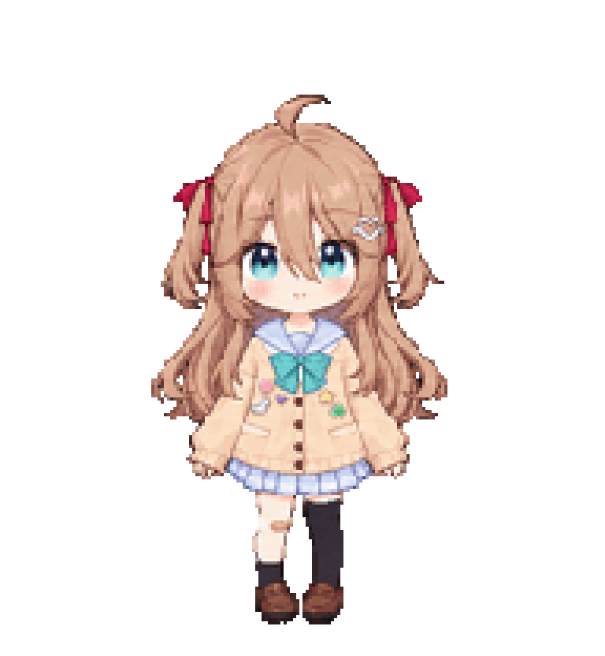
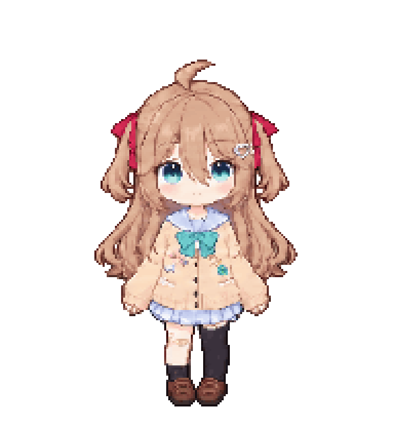
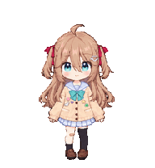
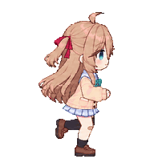
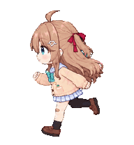
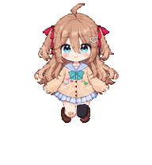
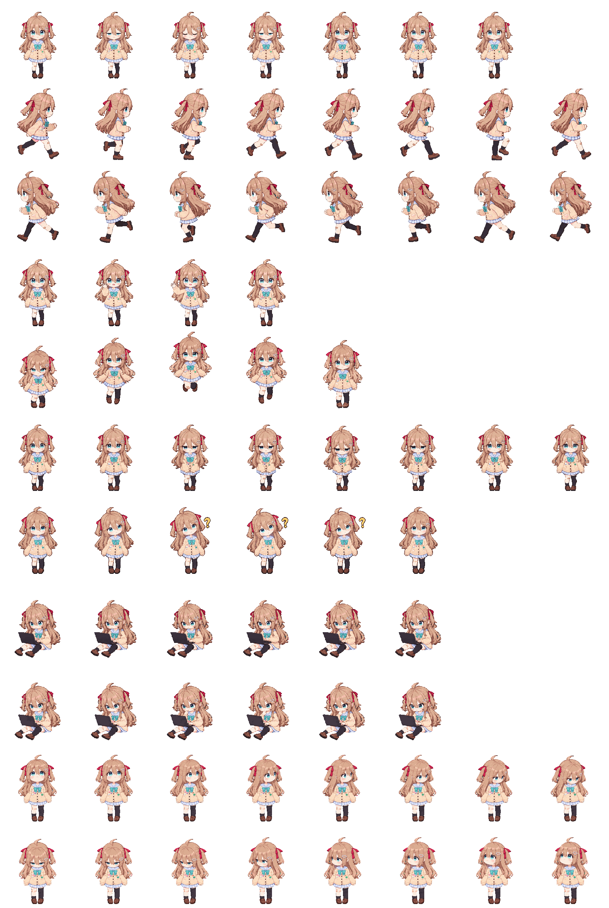

# Neuro-sama V3 · Codex Pixel Pet

[中文](README.md) · [Installation](#installation) · [All animations](ANIMATION-TRIGGERS.md) · [Copyright notice](NOTICE.md)

Bring Neuro-sama V3 to your Codex Mini desktop! Her chibi pixel-art design preserves her long hair, heart-shaped hair clip, mismatched socks, and right-knee bandage. She blinks, runs, waves, jumps, and works with a black laptop. While waiting for a response, she tilts her head toward the left side of the screen as a yellow question mark appears on the right.

The transparent atlas includes **nine animation states, 57 standard animation frames, and sixteen look directions**. This is the first project release, **V1 / v1.0.0**, using **Codex sprite format v2**.

Created and shared by **[Axenor](https://github.com/Axenor)**.

## Animated previews

<table>
  <tr>
    <td align="center" width="33%"><br><b>Idle · breathing and blinking</b></td>
    <td align="center" width="33%"><br><b>Waiting · head tilt and question mark</b></td>
    <td align="center" width="33%"><br><b>Working · laptop typing</b></td>
  </tr>
</table>

See [animations and triggers](ANIMATION-TRIGGERS.md) for every animation. Preview GIFs loop for demonstration; the client controls actual timing and triggers.

## Animation gallery

<table>
  <tr>
    <td align="center" width="33%"><br><b>Idle</b><br><code>idle</code></td>
    <td align="center" width="33%"><br><b>Run right</b><br><code>running-right</code></td>
    <td align="center" width="33%"><br><b>Run left</b><br><code>running-left</code></td>
  </tr>
  <tr>
    <td align="center" width="33%"><br><b>Wave</b><br><code>waving</code></td>
    <td align="center" width="33%"><br><b>Jump</b><br><code>jumping</code></td>
    <td align="center" width="33%"><br><b>Disappointed</b><br><code>failed</code></td>
  </tr>
  <tr>
    <td align="center" width="33%"><br><b>Waiting</b><br><code>waiting</code></td>
    <td align="center" width="33%"><br><b>Working</b><br><code>running</code></td>
    <td align="center" width="33%"><br><b>Review</b><br><code>review</code></td>
  </tr>
</table>

<details>
<summary>View the complete transparent atlas</summary>



1536 × 2288 pixels, 8 × 11 cells, 192 × 208 pixels per cell. Rows 0–8 contain the nine animation states; rows 9–10 contain the sixteen look directions.

</details>

## Installation

### Install from third-party platforms

This project has been uploaded to [codex-pet](https://codex-pets.net/#/pets/neuro-sama-v3) and [petdex](https://petdex.dev/pets/neuro-sama-v3). You can use either platform for a quick and easy installation.

### Install with an Agent

Give this prompt to an Agent with network access and local file permissions:

```text
Install the native v2 Codex pet “Neuro-sama V3” from https://github.com/Axenor/Neuro-sama-codex-pet on this computer.
1. Identify the OS and confirm that the desktop app supports local custom v2 pets.
2. Download and extract https://github.com/Axenor/Neuro-sama-codex-pet/releases/download/v1.0.0/neuro-sama-v3-v1.0.0.zip. If the release is not yet published, explain this and ask whether to use the repository's output/neuro-sama-v3/ files instead.
3. The archive contains neuro-sama-v3/pet.json and neuro-sama-v3/spritesheet.webp.
4. Use the CODEX_HOME configured for the running app. If unset, use the user's .codex directory (Windows) or ~/.codex (macOS). The target is pets/neuro-sama-v3/ beneath that directory.
5. Before writing, verify id=neuro-sama-v3, displayName=Neuro-sama V3, spriteVersionNumber=2, spritesheetPath=spritesheet.webp, and both checksums in SHA256SUMS.
6. If the target directory exists, stop and ask how to handle the existing version. Do not overwrite or delete other pets.
7. Copy only pet.json and spritesheet.webp into the same neuro-sama-v3 directory without adding another nested directory.
8. Report the actual path and verification results. Ask me to refresh Settings → Pets / Mini and pets and select Neuro-sama V3; reopen the app if the entry does not appear.
9. Do not change backend settings, resize the atlas, change the format version, or alter the artwork.
```

### Download a release

Download and extract [neuro-sama-v3-v1.0.0.zip](https://github.com/Axenor/Neuro-sama-codex-pet/releases/download/v1.0.0/neuro-sama-v3-v1.0.0.zip). This link becomes available after the maintainer publishes the `v1.0.0` release with an attachment of that exact name.

The extracted directory contains:

```text
neuro-sama-v3/
├── pet.json
├── spritesheet.webp
├── SHA256SUMS
├── README.md
└── NOTICE.md
```

**Windows (PowerShell):** replace the first path with the actual extracted directory. These commands stop if the target directory exists.

```powershell
$petSourceDir = 'C:\path\to\neuro-sama-v3'
$petCodexRoot = if ([string]::IsNullOrWhiteSpace($env:CODEX_HOME)) {
    Join-Path ([Environment]::GetFolderPath('UserProfile')) '.codex'
} else { $env:CODEX_HOME }
$petTargetDir = Join-Path $petCodexRoot 'pets\neuro-sama-v3'
if (-not (Test-Path -LiteralPath (Join-Path $petSourceDir 'pet.json') -PathType Leaf) -or
    -not (Test-Path -LiteralPath (Join-Path $petSourceDir 'spritesheet.webp') -PathType Leaf)) {
    throw 'Missing installation files in the extracted directory.'
}
if (Test-Path -LiteralPath $petTargetDir) { throw 'Target exists; decide how to preserve the existing version first.' }
New-Item -ItemType Directory -Path $petTargetDir -Force | Out-Null
[System.IO.File]::Copy((Join-Path $petSourceDir 'pet.json'), (Join-Path $petTargetDir 'pet.json'), $false)
[System.IO.File]::Copy((Join-Path $petSourceDir 'spritesheet.webp'), (Join-Path $petTargetDir 'spritesheet.webp'), $false)
Get-Item -LiteralPath (Join-Path $petTargetDir 'pet.json'), (Join-Path $petTargetDir 'spritesheet.webp')
```

**macOS (Terminal):** replace the first path. These commands stop if the source files are missing or the target exists.

```bash
pet_source_dir="/path/to/neuro-sama-v3"
pet_target_dir="${CODEX_HOME:-$HOME/.codex}/pets/neuro-sama-v3"
if [ ! -f "$pet_source_dir/pet.json" ] || [ ! -f "$pet_source_dir/spritesheet.webp" ]; then
  echo "Missing installation files" >&2
elif [ -e "$pet_target_dir" ] || [ -L "$pet_target_dir" ]; then
  echo "Target exists; decide how to preserve the existing version first" >&2
else
  mkdir -p "$(dirname "$pet_target_dir")" && mkdir "$pet_target_dir" &&
  cp -n "$pet_source_dir/pet.json" "$pet_source_dir/spritesheet.webp" "$pet_target_dir/" &&
  ls -lh "$pet_target_dir/pet.json" "$pet_target_dir/spritesheet.webp"
fi
```

Use `Get-FileHash` on Windows to compare the files with `SHA256SUMS`, or run `shasum -a 256 -c SHA256SUMS` inside the extracted directory on macOS.

### Clone the repository

The installation helpers verify the V1 checksums, pet ID, and sprite format before copying the two files. An existing target directory causes the script to stop.

Windows:

```powershell
git clone https://github.com/Axenor/Neuro-sama-codex-pet.git
Set-Location .\Neuro-sama-codex-pet
& .\scripts\install.ps1
```

macOS:

```bash
git clone https://github.com/Axenor/Neuro-sama-codex-pet.git
cd Neuro-sama-codex-pet
bash scripts/install.sh
```

The scripts read `CODEX_HOME`, falling back to `.codex` in the user's home directory. If the app uses another location, specify it explicitly:

```powershell
& .\scripts\install.ps1 -CodexHome 'D:\your-codex-home'
```

```bash
bash scripts/install.sh --codex-home "/path/to/codex-home"
```

### Copy manually

1. Locate `pet.json` and `spritesheet.webp` in the extracted release directory or `output/neuro-sama-v3/` in the repository.
2. Open the Codex user directory used by your app. By default, enter `%USERPROFILE%\.codex\pets\` in Windows File Explorer, or press `⌘ ⇧ G` in Finder and enter `~/.codex/pets/` on macOS.
3. Create a `neuro-sama-v3` directory and place both files inside. If it already exists, handle the previous version before updating it.

The final layout must be:

```text
<CODEX_HOME or the user's .codex>/pets/neuro-sama-v3/
├── pet.json
└── spritesheet.webp
```

### Select the pet

Open **Settings → Pets / Mini and pets → Refresh** and select **Neuro-sama V3**. Labels vary by client version and language. Reopen the app if the entry does not appear. See the [official pet guide](https://learn.chatgpt.com/docs/pets).

To make the character larger, use **Customize → Pet size** in the same settings page. The atlas can remain unchanged. See the [official size controls](https://learn.chatgpt.com/docs/pets).

## Repository layout

```text
Neuro-sama-codex-pet/
├── README.md / README.en.md   # Chinese and English guides
├── NOTICE.md                  # Copyright notice
├── ASSET-USAGE.md             # Usage information and notice link
├── ANIMATION-TRIGGERS.md       # Animations and current client behavior
├── CHANGELOG.md               # V1 / v1.0.0 release notes
├── output/neuro-sama-v3/       # Two native installation files
├── assets/readme/animations/   # Ten transparent GIF previews
├── previews/                  # Nine transparent still previews
├── scripts/                   # Local two-file installation helpers
├── release-manifest.json      # Version, atlas layout, production hashes
├── SHA256SUMS                 # Installation file checksums
├── .gitattributes
└── .gitignore
```

## Tips

If the character looks too small, go to Settings → Mini and pets → Customize → Pet size to adjust it. The maximum size is twice the default.

## Credits and copyright

Created and shared by **Axenor**. This pixel pet was made from supplied character references using AI-assisted image creation, animation assembly, and local revisions.

This is a fan-made Neuro-sama derivative work. Rights to the original character, design, and related IP remain with their respective rights holders. This repository grants no license to the underlying character IP. See [NOTICE.md](NOTICE.md) and [ASSET-USAGE.md](ASSET-USAGE.md).

